# The legal side of the POSS world
## (sort of)

Richard Fontana OSCON 2013

.fx: titleslide

---

## This talk has nothing to do with Marten Mickos.

---

# Deconstruction of a tweet
 
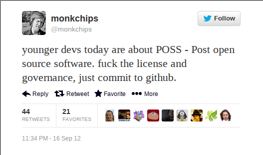

---

# Licensing

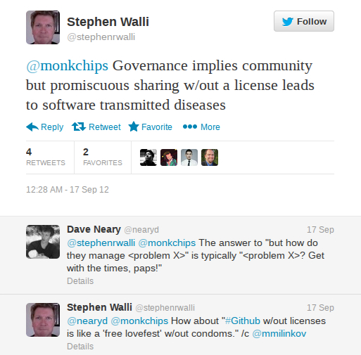

---
## Déjà vu all over again

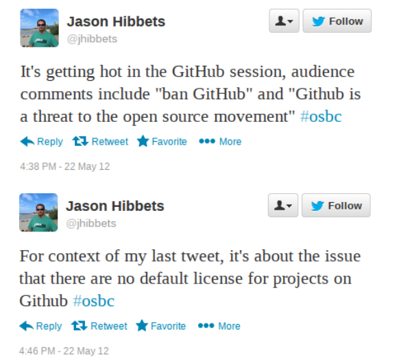

---

## The intelligentsia responds

* Legal-formalist alarmism; irresponsible GitHub, ignorant kids
* Bad for business &rarr; bad for open source
* Association with broader free culture legal trends

---

### *GitHub needs to take open source seriously*

* "Under copyright law, code without a license cannot be legally shared"; danger of future &copy; infringement litigation
* Encourages platform growth by appealing to younger devs' "licensing is for losers" sensibilities

---
## Notices under US copyright law

* 1909 Copyright Act: works published without notice automatically
  entered public domain
* 1976 Copyright Act: copyright attaches automatically on creation
* 1978-01-01 - 1989-03-01 (pre-Berne): publication without notice = public
domain unless effort to correct within 5 years
* Berne (present): absence of notice has no effect on copyright protection

---
## Law in books vs. law in action
 

* If "unlicensed code" is ARR, why treat it as an open source problem?
* If we assume developers *want* code to be open source but just don't know how to do it "properly", copyright infringement risk here must be low
* No reason to think "unlicensed code" is most significant liability
risk for users of GitHub-hosted code

---

## Implied copyright license?

* May arise from circumstances creating reasonable expectation that
  &copy; holder intends work to be used for some purpose
* For GitHub-hosted code, decent argument for implied broad license
  to copy, prepare derivative works, and distribute *for development
  purposes* 
* But with "no-declared-license" code, can't necessarily
  easily get to 'implied **fully-OSD-conformant** license' without
  special facts 

---

## GitHub's statements don't help here

* Doll: on GitHub, absence of explicit license rightly
  *interpreted* as ARR
* ToS: "By setting your repositories to be viewed publicly, you
agree to allow others to **view and fork** your repositories"

---

## Lack of license a "disturbing trend"
 

"ensures software will be removed from any product meant to be used by
**corporations**", undercutting goal of broad code reuse

---

## 'Only benefits lawyers' corollary

Luis Villa, *Licensing confusion is great! (for lawyers)*

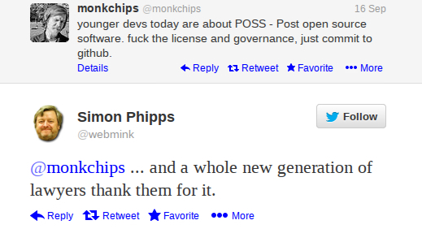

---

### Shavianism taken to an extreme?

* "The last thing a startup wants to admit is that they don’t own their intellectual property"
* "No reason to give them unrestricted use of my software since they are only interested in turning my software into a hot IPO 2–5 years from now"

*Why I (A/L)GPL* (2009)

---

### *Pushing back against licensing and the permission culture*

* MIT probably most common explicit GitHub license
* Recent PDD instruments: CC0 (2009), "The Unlicense" (2010)

* Villa: POSS as implicit critique of "open license ecosystem" assumption:
sharing can't/shouldn't be done without explicit permission 

---

## Some firsthand experience

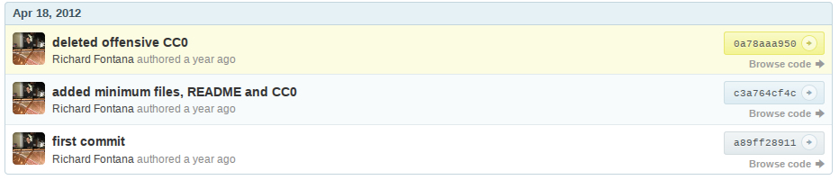

*Lots* of GitHub repositories are trivial, de minimis

---

## Lawyer discussion

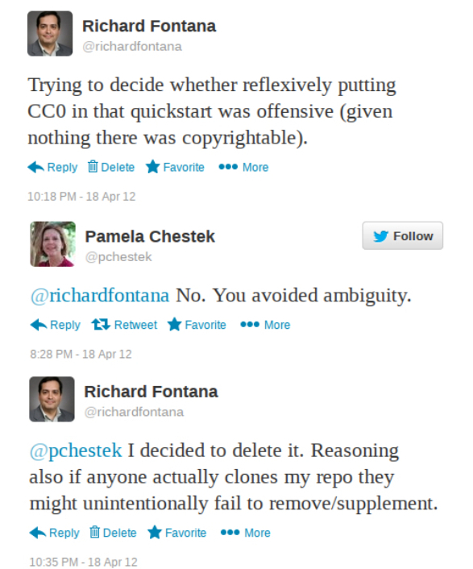
(Notice we're both concerned about problem of ambiguity)

---

## Evidence?

* Williamson: via FOSSology, 16.6% of 28% oldest GitHub repos have licensing information at **top level** (widely misreported by sensationalists)
(*Licensing of Software on GitHub: A Quantitative Analysis*)
* Berkholz analysis of Ohloh data: POSS is largest license trend in absolute market share; associated with smallest projects (which tend to be on GitHub)
(*The size of open-source communities and its impact upon activity, licensing, and hosting*)

---

### Why assume this is new/GitHub-specific?

* Palamida, Black Duck have claimed so
* Google Code, SourceForge licensing requirements?
* GitHub popularity exposed
phenomenon of "no-explicit-license seemingly-FLOSS code" to the 
previously innocent
* Usenet newsgroups for "public domain sources" (1980s to mid-1990s) - is
"unlicensed code" uninterrupted free software tradition?

---

### Overlooked: GitHub facilitates transparent, collaborative legal improvements

* Many users submit "add a license" issues/PRs (sometimes 
corporate or Linux distro concerns)
* Project creator often apologetic and seeks education/consensus
* In many cases a license *is* present but non-obviously presented!
* License selection is simply being "delayed"?
* Not just "ignorant kids"

---

### Typical "preferably MIT" example

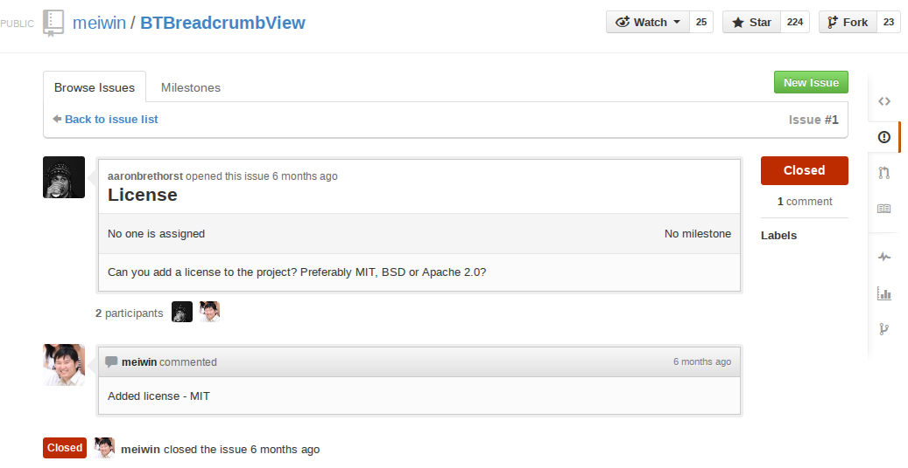

Users empowered to participate in license selection 

---

### Consistent with Berkholz conjecture:

"as projects grow, they tend to sort out any licensing issues, likely
because they get corporate users, professional developers, etc."

---

## What GitHub did last week

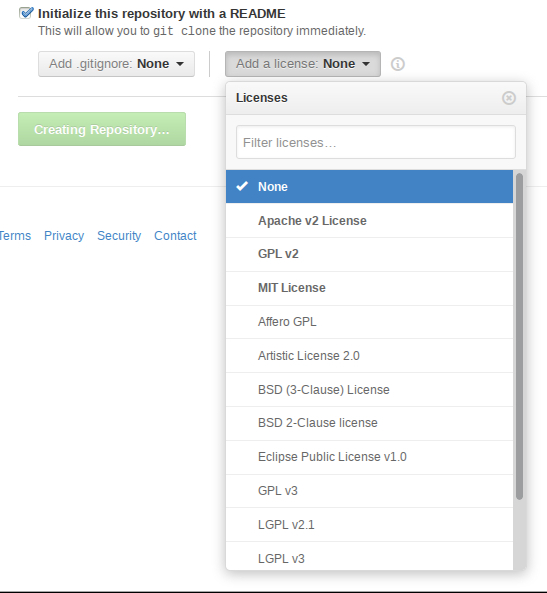

---

## choosealicense.com

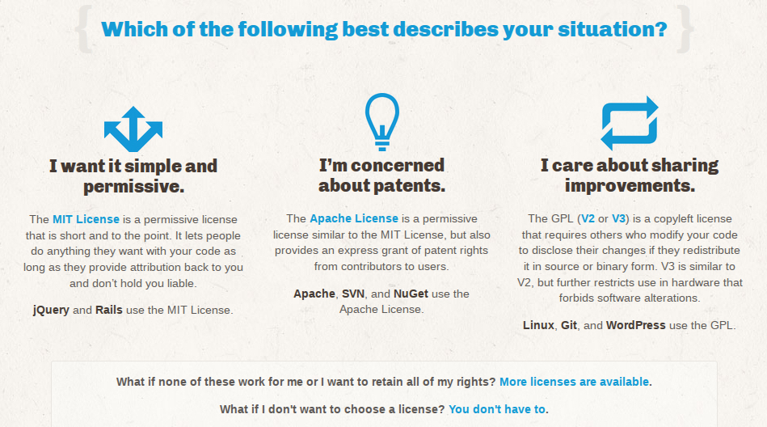

---

## choosealicense.com/licenses/

* "Featured": Apache 2.0, GPLv2, MIT
* "Other licenses": MPL 2.0, LGPLv2.1, 3-clause BSD, Artistic 2.0, GPLv3, LGPLv3, AGPLv3, **"Public Domain (Unlicense)"**, **"No License"**, EPL, 2-clause BSD
* CC-deed-reminiscent descriptions containing annoying errors
* Website is MIT-licensed; can fork and make pull requests

---

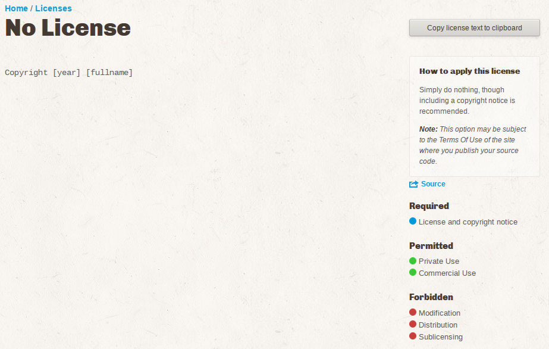

---

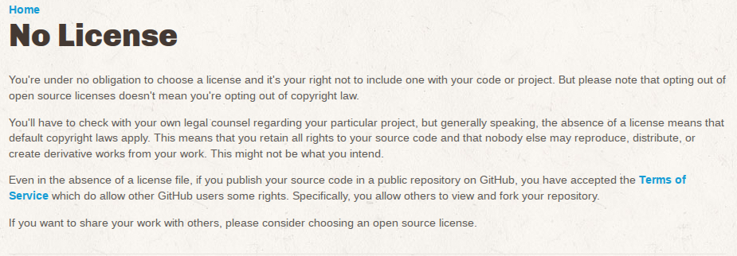

---
# Governance

---

## A decade of management research

* All open source projects have 'governance' (they all make 
decisions); licensing initially seen as key element
* Wasserman & Capra (2007): 35% of community projects sampled "not managed at all" (= issues are decided via mailing lists)

---

### *When Free Software Isn't Better* (2010)

SourceForge & Savannah studies: most free software projects (even
actively-released and frequently-downloaded) are single developer with
little or no outside help 

(Consistent with Berkholz in 2013 Ohloh study)

---

### Within FLOSS, *normative* governance no older than 2011

* Phipps, *Open By Rule* (Feb. 2011) (software freedom requires 
"community equality guaranteed by fair governance")
* JimJag, *Lessons Learned in Open Source at Apache* (Oct. 2011)
(3 governance types cover all projects; ASF meritocracy subtype is good)
* Skerrett, *Open Source Governance: The Eclipse Model* (Oct. 2012) (good 
Eclipse governance features promote long-term community health)

---

### *Apache Considered Harmful* (Nov. 2011)

<ul style="padding-top:-3px;">
<li> GitHub is anarchic, decentralized, unmediated developer-to-developer communication system, imposing no "set of governance or process" on its users
<li> Fork possibility creates "social imperative to **manage** contributions in a satisfactory manner"
</ul>

Probably what Governor meant, and what 'project governance'
foundations see as a threat

---

## Some general conclusions

* I don't think there is any 'POSS'
* 'Unlicensed code' has been around forever (though may be increasing as part
of shift away from copyleft)
* Main problem is 
*ambiguity*, but GitHub is being used by users to efficiently *solve* this issue
* Apache/Eclipse-style 'good governance' is a new marketing angle and irrelevant to
most projects

---
# Thanks!

@richardfontana

